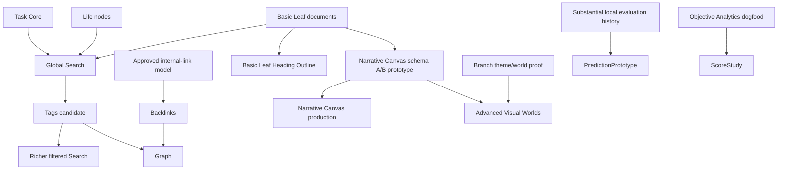

# Slice 007 Specification — Expansion Decision

## Decision authority

The Product Owner holds final authority over all expansion activation decisions. No candidate may be activated by a task agent alone. This specification records the analysis and recommendation for Product Owner approval.

Source-of-truth constraints are immutable:
- `LOCKED` is not the same as `OPEN`.
- Technology substrate is not feature approval.
- `PROTOTYPE-GATED` cannot be silently promoted to production.
- `DEFERRED` cannot be treated as active.
- `REMOVED` functionality cannot return through a dependency.

## Current implemented baseline

### Task pillar

Implemented: Today-default task workflow; one-off task CRUD; exact-minute time semantics; recurrence and occurrence overrides; Week Strip; Calendar projection; completion evaluation and undo; objective Week/Month/Year Analytics; category minimum/target goals; objective streaks.

Absent: total score; score streak; prediction; actual-time tracker; reminder, notification and sound.

### Life pillar

Implemented: protected neutral Life root; focal Browse with direct children only; breadcrumbs, session history and persisted navigation; Pinned mode; full-tree Edit mode; create, rename, reorder, reparent, archive/restore and undo; Basic Leaf versioned documents; static Reader; lazy focused Tiptap editor; revision history and recovery drafts; stable-ID local images; Markdown import/export; backup/restore containing assets.

Absent: Narrative Canvas; scenes, templates and custom visual blocks; visual-world engine; global Search; Tags; Backlinks; Outline; Noteboard; Graph; Task/Life relations.

### Scale at Task 16

- Frontend tests: 118. Rust tests: 292. Migration: 9.
- Production chunks: main ~484 kB minified; lazy Basic Leaf editor ~443 kB; lazy Markdown pipeline ~117 kB.
- F-04/F-05 durability closed. Unsigned NSIS build passed. Contained two-session RC dogfood passed.
- FTS5 is compiled into bundled SQLite (`rusqlite = 0.40.1`, `SQLITE_ENABLE_FTS5`).
- Basic Leaf already stores extracted plain text beside canonical ProseMirror JSON.

## Candidates

Ten candidates evaluated independently:

1. Global Search
2. Outline
3. Visual Worlds
4. Narrative Canvas
5. Tags
6. Backlinks
7. Score
8. Prediction
9. Noteboard
10. Graph

## Hard filters

Twelve mandatory hard filters apply to each candidate. A single `FAIL` blocks immediate activation.

| Candidate | Result | Decisive reason |
|---|---|---|
| Global Search | PASS 12/12 | Bounded local index; direct retrieval problem; no unapproved prerequisite. |
| Outline | CONDITIONAL | Must be narrowed to a Basic Leaf heading outline; generic Outline duplicates Life navigation. |
| Visual Worlds | CONDITIONAL | Needs Product Owner choice on palette, count and intensity plus measured contrast/performance budgets. |
| Narrative Canvas | CONDITIONAL | Needs isolated schema prototype, migration proof, accessibility model and strict scene/block minimum. |
| Tags | CONDITIONAL | Must prove value beyond Task categories and Life hierarchy and define merge/archive semantics. |
| Backlinks | FAIL | No approved link-creation model or sufficient relationship corpus. |
| Score | FAIL | Formula is OPEN and could create a misleading productivity judgment. |
| Prediction | FAIL | Insufficient history/calibration; trust and uncertainty controls are not yet justified. |
| Noteboard | FAIL | No demonstrated core workflow; duplicates organization and risks Task-card regression. |
| Graph | FAIL | Depends on missing links/tags; duplicates Life tree; requires accessible alternative and heavy rendering. |

## Weighted model

Eleven criteria, 100 total weight:

| Criterion | Weight |
|---|---:|
| Direct user value in the current product | 20 |
| Frequency and workflow leverage | 12 |
| Fit with Task/Life pillars | 12 |
| Differentiation and visual/product identity | 9 |
| Data safety and reversibility | 10 |
| Accessibility feasibility | 7 |
| Performance/startup feasibility | 7 |
| Low implementation complexity | 8 |
| Low maintenance burden | 6 |
| Testability and observability | 5 |
| Prerequisite independence | 4 |

Base weighted rankings:

| Rank | Candidate | Score / 10 |
|---|---|---|
| 1 | Global Search | 8.661 |
| 2 | Outline | 7.602 |
| 3 | Visual Worlds | 6.978 |
| 4 | Tags | 6.935 |
| 5 | Backlinks | 6.387 |
| 6 | Narrative Canvas | 6.161 |
| 7 | Score | 5.851 |
| 8 | Noteboard | 5.232 |
| 9 | Prediction | 5.105 |
| 10 | Graph | 4.102 |

## Sensitivity analysis

The four-million-sample analysis is a sensitivity test over explicit subjective priors, not an empirical user study and not proof created by a large iteration count. Its value is that the Search recommendation remains stable under broad, disclosed changes to weights and candidate scores.

Fixed master seed: `20260802`. Four profiles (Base, Utility-first, Visual-identity-first, Safety/maintenance-first), 1,000,000 samples each. Dirichlet concentration `250`. Candidate-specific score uncertainty (σ): Search 0.45, Outline 0.60, Visual Worlds 0.80, Narrative Canvas 0.90, Tags 0.70, Backlinks 0.75, Score 0.90, Prediction 1.00, Noteboard 0.80, Graph 0.90.

| Candidate | Aggregate top-1 % | Aggregate mean rank |
|---|---|---|
| Global Search | 93.449 | 1.066 |
| Outline | 5.884 | 2.255 |
| Visual Worlds | 0.661 | 3.582 |
| Tags | 0.002 | 3.833 |
| Narrative Canvas | 0.005 | 6.034 |
| All others | 0.000 | — |

Global Search ranks first in 93.449% of all sampled scenarios. It remains first in 100% of Base, 100% of Utility-first, 97.33% of Visual-identity-first, and 76.47% of Safety/maintenance-first scenarios.

## Recommendation vocabulary

| State | Meaning |
|---|---|
| `ACTIVATE_NEXT` | Sole next implementation candidate; requires Product Owner approval before Task 18. |
| `HOLD_FOR_PRODUCT_OWNER` | Strong candidate but requires aesthetic/policy decisions only the Product Owner can make. |
| `DEFER` | Not ready for activation; specific gaps recorded. |

No candidate is marked `RECOMMEND_REMOVE`. Source labels (`OPEN`, `DEFERRED`) are preserved.

## Prerequisite graph

### Mermaid



### Plain text

```text
Task Core + Life Core + Basic Leaf
    → Global Search

Global Search
    → optional future tag filtering

Approved internal links
    → Backlinks
    → Graph

Tags
    → richer Search
    → Graph

Basic Leaf
    → narrow document Outline

Basic Leaf dogfood
    → Narrative Canvas schema A/B prototype
    → production Narrative Canvas
    → advanced Visual Worlds

Evaluation history
    → Prediction study

Objective Analytics dogfood
    → Score study
```

## Selected recommendation

| Candidate | Recommendation | Reason |
|---|---|---|
| Global Search | `ACTIVATE_NEXT` | Highest direct utility, highest frequency leverage, clean local-first fit, bounded schema, accessible interaction model, strongest robustness across all decision profiles. |
| Outline | `DEFER` | Strong second-place only after narrowing to document-heading outline; generic Outline duplicates Life navigation. |
| Visual Worlds | `HOLD_FOR_PRODUCT_OWNER` | Strong identity value; palette/world count and visual intensity are aesthetic Product Owner decisions. |
| Narrative Canvas | `DEFER` | Potentially differentiating; requires bounded schema A/B prototype after additional Basic Leaf dogfood. |
| Tags | `DEFER` | Useful later as cross-cutting classification; currently overlaps Task categories and Life hierarchy. |
| Backlinks | `DEFER` | Requires an approved intentional link-creation model and enough links to produce value. |
| Score | `DEFER` | Formula is OPEN; objective Analytics already exists; distortion risk without actual-time semantics. |
| Prediction | `DEFER` | Insufficient local evaluation history, calibration evidence and trust justification. |
| Noteboard | `DEFER` | No core workflow demonstrates a card board is needed; risks duplicating Life organization. |
| Graph | `DEFER` | Relationship data, tags and backlinks absent; global graph complexity and accessibility cost unjustified. |

### Task 18 minimum scope (if approved)

Title: `Global Search Core + Vietnamese-Normalized Unified Retrieval`

Search only active Tasks, active Life nodes, and active Basic Leaf documents. Optional archived inclusion requires an explicit filter.

Result groups: Tasks; Life; Documents. Each result exposes only: stable entity ID; entity type; title; safe short snippet; breadcrumb/date/category context; navigation target; rank; archived flag when applicable.

UI: keyboard-first command/search palette; no permanent main-sidebar destination; type-to-search; Arrow Up/Down; Enter to open; Escape to close; deterministic empty/loading/error states; screen-reader result count; no HTML injection from snippets; no remote requests.

Task 18 explicit exclusions: semantic/vector search; embeddings; AI summaries; web search; Tags; Backlinks; Graph; saved views; query language visible to ordinary users; fuzzy ML; Task/Life relation schema; search analytics/telemetry.

Kill criteria: FTS5 unavailable in bundled binary; index consistency cannot be guaranteed or rebuilt; p95 query latency misses budget on realistic fixtures; snippets cannot be rendered safely; Vietnamese normalization causes unacceptable false collisions; implementation requires cloud/AI/vector infrastructure.

## Non-implementation boundary

Task 17 adds no product behavior. Prohibited changes: dependencies; `Cargo.toml`; `package.json`; lockfiles; migrations; FTS tables; UI; IPC; permissions; application behavior; GitHub Actions; NSIS build; polling.

## Product Owner approval gate

```text
Recommended next activation:
ACTIVATE_NEXT — Global Search

Recommended Task 18 execution title:
Global Search Core + Vietnamese-Normalized Unified Retrieval

Product Owner decision required:
APPROVE / REJECT / MODIFY
```
