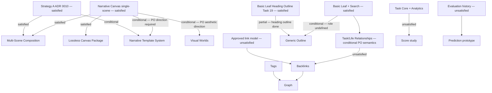

# Slice 013 Specification — Post-Narrative Expansion Decision (Accepted)

**Preliminary record:** commit `0dce8e9` (preliminary model, substituted criteria) is preserved as a draft.
**Accepted record:** this document, superseded by ADR 0018.

---

## Decision authority

The Product Owner holds final authority over all expansion activation decisions. No candidate may be activated by a task agent alone. This specification records the analysis and recommendation for Product Owner approval.

Source-of-truth constraints are immutable:
- `LOCKED` is not the same as `OPEN`.
- Technology substrate is not feature approval.
- `PROTOTYPE-GATED` cannot be silently promoted to production.
- `DEFERRED` cannot be treated as active.
- `REMOVED` functionality cannot return through a dependency.

This sensitivity analysis is over disclosed expert assumptions, not empirical user evidence.

---

## Implemented baseline at Task 22

### Task pillar

Implemented: Today-default task workflow; one-off task CRUD; exact-minute time semantics; recurrence and occurrence overrides; Week Strip; Calendar projection; completion evaluation and undo; objective Week/Month/Year Analytics; category minimum/target goals; objective streaks.

Absent: total score; score streak; prediction; actual-time tracker; reminder, notification and sound.

### Life pillar

Implemented: protected neutral Life root; focal Browse with direct children only; breadcrumbs, session history and persisted navigation; Pinned mode; full-tree Edit mode; create, rename, reorder, reparent, archive/restore and undo; Basic Leaf versioned documents; static Reader; lazy focused Tiptap editor; Basic Leaf heading Outline (Task 19); revision history and recovery drafts; stable-ID local images; Markdown import/export.

Narrative Canvas (Tasks 20–22): one-scene knowledge-dossier Canvas schema (Strategy A, ADR 0010); Reader and Studio vertical slice; rich_text, metric, image, callout, timeline block kinds; Markdown export and import for Canvas documents.

Absent: multi-scene Canvas; Canvas templates; visual-world engine; Tags; Backlinks; Task/Life relations; lossless portable archive format; Graph; Noteboard.

### Search

FTS5 external-content index over Tasks, Life nodes, and Basic Leaf documents (Task 18); Vietnamese normalization; dirty-scope rebuild queue; BM25 ranking; Ctrl+K dialog; navigation integration.

### Scale at Task 22

- Frontend tests: 399. Rust tests: 388. Schema: migration 14.
- Production chunks: main ~494 kB; Studio lazy ~14.96 kB; Tiptap vendor ~390 kB (Studio-only).
- No cloud dependency. No external auth. Fully offline.

---

## Candidates

Exactly 13 candidates evaluated independently:

1. Narrative Multi-Scene Composition
2. Narrative Template System
3. Visual Worlds
4. Lossless Canvas Package
5. Tags
6. Backlinks
7. Task/Life Relationships
8. Noteboard
9. Graph
10. Score
11. Prediction
12. Generic Outline
13. No Expansion / Core Evidence + Release Readiness Hardening

---

## Hard-filter matrix (13 candidates × 14 filters)

Filters:

| # | Filter | Required question |
|---|---|---|
| F1 | Source authority | Compatible with immutable source and accepted ADRs? |
| F2 | Product pillar integrity | Avoids a third pillar and Task card regression? |
| F3 | Local-first | No server/account/cloud/network dependency? |
| F4 | Data authority | Safe canonical model, migration, rollback, and recovery? |
| F5 | User value | Concrete recurring workflow not already covered? |
| F6 | Duplication | Does not duplicate Life/Search/Outline/Canvas? |
| F7 | Accessibility | Complete keyboard/screen-reader/non-visual design plausible? |
| F8 | Performance | Fits realistic local scale and bundle budgets? |
| F9 | Interoperability | Backup/export/recovery behavior is definable? |
| F10 | Privacy/security | No telemetry, remote assets, or unsafe execution? |
| F11 | Prerequisites | Mandatory prerequisites already active? |
| F12 | Scope boundedness | Meaningful one-run minimum exists? |
| F13 | Maintenance | Cost is proportionate to demonstrated value? |
| F14 | Acceptance evidence | Objective local verification is possible? |

Result codes: **P** = PASS, **C** = CONDITIONAL, **F** = FAIL.

| Candidate | F1 | F2 | F3 | F4 | F5 | F6 | F7 | F8 | F9 | F10 | F11 | F12 | F13 | F14 | Outcome |
|---|---|---|---|---|---|---|---|---|---|---|---|---|---|---|---|
| Multi-Scene | P | P | P | P | P | P | P | P | P | P | P | P | P | P | **PASS** |
| Template System | P | P | P | C¹ | C² | P | P | P | P | P | C³ | C⁴ | C⁵ | C⁶ | **CONDITIONAL** |
| Visual Worlds | P | P | P | C⁷ | P | P | C⁸ | C⁹ | P | P | C¹⁰ | C¹¹ | C¹² | C¹³ | **CONDITIONAL** |
| Lossless Package | P | P | P | P | C¹⁴ | C¹⁵ | P | P | P | P | P | P | P | P | **CONDITIONAL** |
| Tags | P | P | P | C¹⁶ | C¹⁷ | C¹⁸ | P | P | C¹⁹ | P | C²⁰ | C²¹ | C²² | C²³ | **CONDITIONAL** |
| Backlinks | P | P | P | C²⁴ | C²⁵ | C²⁶ | C²⁷ | P | C²⁸ | P | **F**²⁹ | C³⁰ | C³¹ | C³² | **FAIL** |
| Task/Life Rel. | P | C³³ | P | C³⁴ | P | P | P | P | C³⁵ | P | C³⁶ | C³⁷ | C³⁸ | C³⁹ | **CONDITIONAL** |
| Noteboard | P | **F**⁴⁰ | P | C | C⁴¹ | **F**⁴² | C | P | C | P | **F**⁴³ | C | C | C | **FAIL** |
| Graph | P | C | P | **F**⁴⁴ | C | **F**⁴⁵ | **F**⁴⁶ | C⁴⁷ | C | P | **F**⁴⁸ | C | C | C | **FAIL** |
| Score | P | P | P | C | C⁴⁹ | C⁵⁰ | P | P | C | P | **F**⁵¹ | C | C | **F**⁵² | **FAIL** |
| Prediction | P | P | P | C | C⁵³ | P | P | P | C | P | **F**⁵⁴ | C | C | **F**⁵⁵ | **FAIL** |
| Generic Outline | P | P | P | P | C⁵⁶ | C⁵⁷ | P | P | P | P | C⁵⁸ | C⁵⁹ | P | P | **CONDITIONAL** |
| Hardening Slice | P | P | P | P | P | P | P | P | P | P | P | P | P | P | **PASS** |

**PASS (eligible for activation):** Multi-Scene, No Expansion / Hardening Slice.

**CONDITIONAL (ineligible for immediate activation):** Template System, Visual Worlds, Lossless Canvas Package, Tags, Task/Life Relationships, Generic Outline.

**FAIL (ineligible):** Backlinks, Noteboard, Graph, Score, Prediction.

### Evidence notes for non-PASS cells

¹ Template schema migrations must not break existing canvas rows — backwards compat design not yet defined.
² Template value depends on content and count not yet designed; no concrete workflow demonstrated.
³ Stable production Canvas exists, but Product Owner template content/count direction is required before schema commits.
⁴ Minimum scope undefined without template definitions.
⁵ Per-template maintenance cost unknown without template count.
⁶ Template-specific behavior is not objectively verifiable without defined templates.
⁷ Visual-world/atmosphere schema design not yet defined.
⁸ Forced-colors, high-contrast, and reduced-motion behavior for world rendering is unverified.
⁹ World rendering performance budget not measured at realistic local scale.
¹⁰ Stable scene/template contract + Product Owner aesthetic direction required.
¹¹ World count and intensity decisions remain with Product Owner.
¹² Visual maintenance cost (theming, contrast corrections) is high and proportionality unproven.
¹³ Aesthetic acceptance criteria are not objectively measurable.
¹⁴ Concrete recurring use case beyond existing Markdown export and backup not demonstrated.
¹⁵ Overlaps partially with existing Markdown export workflow.
¹⁶ Tag schema, merge semantics, and archive behavior are undefined.
¹⁷ Value beyond Task categories and Life hierarchy not demonstrated.
¹⁸ Tags partially duplicate Task category and Life hierarchy classification.
¹⁹ Tag backup/export semantics undefined.
²⁰ Global vs scoped tag semantics require Product Owner direction.
²¹ Minimum scope unclear without semantic definition.
²² Long-term maintenance cost depends on tag count and schema flexibility.
²³ Success metric undefined without tag semantics.
²⁴ Link authority schema not yet designed.
²⁵ No demonstrated recurring link-creation workflow.
²⁶ Partially duplicates Life tree as navigation relationship.
²⁷ Link graph navigation screen-reader model not specified.
²⁸ Link backup/export semantics undefined.
²⁹ **FAIL:** No approved link-creation model exists; no link corpus present in the database.
³⁰ Minimum scope requires a link-creation model that is not yet approved.
³¹ Maintenance cost of link consistency across archive/restore is unknown.
³² Correctness not measurable without a link corpus.
³³ A join between Task and Life pillars could form a de facto third relationship authority without a clear owner.
³⁴ Cardinality, ownership, and cascade semantics on archive/restore not decided.
³⁵ Relationship backup/export semantics undefined.
³⁶ Cardinality/ownership/display policy requires Product Owner direction.
³⁷ Display and edit UX minimum scope depends on cardinality policy.
³⁸ Long-term maintenance of relationship consistency during archive/restore is unknown.
³⁹ Success metric depends on display policy not yet defined.
⁴⁰ **FAIL:** Introduces a card-board paradigm that risks Task-card regression; CLAUDE.md rule: "Keep Task rows non-card and Today task-first."
⁴¹ No demonstrated core workflow requiring a card board.
⁴² **FAIL:** Substantially duplicates Life organization and Today task-first flow.
⁴³ **FAIL:** No workflow demonstrates that a card board is needed; prerequisite use case absent.
⁴⁴ **FAIL:** Data authority undefined; depends on missing link and tag schemas.
⁴⁵ **FAIL:** Substantially duplicates Life tree as a visual hierarchical structure.
⁴⁶ **FAIL:** Screen-reader accessible alternative for graph navigation not specified; keyboard-only traversal of arbitrary graphs is complex and unresolved.
⁴⁷ Graph rendering at scale with large link corpora unmeasured.
⁴⁸ **FAIL:** Missing tags and links are mandatory prerequisites.
⁴⁹ Value proposition relative to existing Objective Analytics not demonstrated.
⁵⁰ Partially duplicates Objective Analytics completion/streak domain.
⁵¹ **FAIL:** Score formula is OPEN; actual-time semantics are absent; distortion risk without calibrated formula.
⁵² **FAIL:** Correctness of a formula-based score is not measurable without a defined formula.
⁵³ Trust requires calibration evidence not yet available.
⁵⁴ **FAIL:** Insufficient local evaluation history and calibration evidence.
⁵⁵ **FAIL:** Prediction correctness is not locally measurable without sufficient historical ground truth.
⁵⁶ Generic role beyond the Task 19 heading outline not demonstrated in a concrete workflow.
⁵⁷ Partially duplicates the existing Basic Leaf heading outline (Task 19) and Life tree navigation.
⁵⁸ Role as a generic Outline beyond document headings requires Product Owner direction.
⁵⁹ Minimum scope is ambiguous without role definition beyond Task 19.

---

## Approved weighted decision model

| # | Criterion | Weight |
|---|---|---:|
| 1 | Immediate user value | 16 |
| 2 | Workflow frequency | 10 |
| 3 | Differentiation / product identity | 10 |
| 4 | Data safety and reversibility | 12 |
| 5 | Accessibility feasibility | 9 |
| 6 | Implementation boundedness | 9 |
| 7 | Maintenance cost (10 = low burden) | 8 |
| 8 | Performance feasibility | 7 |
| 9 | Local-first / privacy fit | 6 |
| 10 | Interoperability / backup clarity | 5 |
| 11 | Prerequisite readiness | 5 |
| 12 | Evidence / testability | 3 |
| | **Total** | **100** |

Higher is always better on all criteria. Maintenance cost: 10 = low burden, 0 = extreme burden.

### Candidate scores [0–10]

Scores listed as [C1,C2,C3,C4,C5,C6,C7,C8,C9,C10,C11,C12] matching the criterion order above. σ = epistemic score uncertainty.

| Candidate | Filter | Scores | σ | Base score |
|---|---|---|---|---|
| Multi-Scene | PASS | 8,7,9,7,8,8,7,8,10,8,10,8 | 0.65 | **8.02** |
| Hardening Slice | PASS | 6,5,3,9,9,9,9,8,10,9,10,9 | 0.55 | **7.56** |
| Generic Outline | COND | 5,5,4,9,9,7,8,9,10,8,5,9 | 0.65 | 7.01 |
| Lossless Package | COND | 5,4,6,8,8,7,7,8,10,10,7,8 | 0.70 | 6.92 |
| Task/Life Rel. | COND | 7,7,6,6,8,5,6,8,10,6,4,7 | 0.80 | 6.66 |
| Template System | COND | 5,4,8,6,7,5,5,8,10,6,3,5 | 0.90 | 5.96 |
| Tags | COND | 5,5,5,6,8,5,5,8,10,5,4,5 | 0.85 | 5.85 |
| Visual Worlds | COND | 6,4,10,5,4,4,4,5,10,7,3,4 | 1.00 | 5.57 |
| Score | FAIL | 4,4,5,6,7,4,5,8,10,5,2,2 | 0.80 | 5.22 |
| Prediction | FAIL | 3,3,6,5,7,3,3,5,10,4,1,1 | 0.90 | 4.35 |
| Backlinks | FAIL | 4,3,7,5,5,4,4,6,10,4,1,4 | 0.85 | 4.76 |
| Noteboard | FAIL | 2,2,5,5,5,4,3,5,10,4,3,4 | 0.70 | 4.09 |
| Graph | FAIL | 3,2,7,3,2,2,2,2,10,3,1,3 | 0.70 | 3.29 |

### Score rationale (eligible candidates)

**Multi-Scene (8.02):** Extends a live Strategy-A Canvas with no schema contradiction (criterion 11 = 10). Multi-section knowledge dossiers are a clear recurring workflow (C1 = 8, C2 = 7). High visual/identity fit as the primary Canvas differentiator (C3 = 9). Additive migration risk but manageable (C4 = 7). Hardening wins on data safety, maintenance, interoperability, and evidence (C4–C14) because those criteria favor hardening work over features.

**Hardening Slice (7.56):** Direct improvement to data safety and accessibility (C4 = 9, C5 = 9); zero prerequisite gaps (C11 = 10); strongest evidence/testability score (C12 = 9). Lower on user-visible value (C1 = 6), workflow frequency (C2 = 5), and differentiation (C3 = 3), since hardening is not feature-visible. Wins safety/maintenance and recovery/readiness profiles by design.

---

## Sensitivity analysis

### Profiles (each sums to 100)

| # | Profile | Weights [C1…C12] | Emphasis |
|---|---|---|---|
| 1 | Base | 16,10,10,12,9,9,8,7,6,5,5,3 | Approved model weights |
| 2 | Utility-first | 26,18,7,9,6,15,5,5,4,2,2,1 | User value, frequency, boundedness |
| 3 | Visual-identity-first | 20,7,26,9,6,7,6,5,6,4,3,1 | Differentiation and user value |
| 4 | Safety/maintenance-first | 10,6,5,20,15,7,15,12,4,3,2,1 | Data safety, accessibility, maintenance, performance |
| 5 | Recovery/readiness-first | 10,6,5,18,13,8,8,7,5,10,7,3 | Data safety, interop, evidence, accessibility |

Seed: `20260803`. Samples: 1,000,000 per profile = 5,000,000 total. Method: Dirichlet weight perturbation (α = profile weight vector) × Gaussian score noise (σ per candidate, clipped to [0,10]).

Eligible-candidate mask from hard-filter outcomes applied. CONDITIONAL and FAIL candidates are excluded from activation probability; scored for diagnostic comparison only.

### Per-profile base scores (eligible candidates)

| Profile | Multi-Scene | Hardening Slice | Profile winner |
|---|---|---|---|
| Base | 8.02 | 7.56 | **Multi-Scene** |
| Utility-first | 7.87 | 7.09 | **Multi-Scene** |
| Visual-identity-first | 8.22 | 6.60 | **Multi-Scene** |
| Safety/maintenance-first | 7.76 | 8.10 | Hardening Slice |
| Recovery/readiness-first | 7.97 | 8.21 | Hardening Slice |

### Simulation results (eligible candidates only)

| Candidate | Agg. mean score | Top-1 % | Top-3 % | Mean rank | Pairwise vs base winner |
|---|---|---|---|---|---|
| **Multi-Scene** | **7.943** | **65.8 %** | 100 % | 1.34 | — |
| Hardening Slice | 7.489 | 34.2 % | 100 % | 1.66 | 34.2 % |

Top-3 % is 100 % for both candidates because there are exactly 2 eligible candidates.

### Per-profile top-1 probability (eligible)

| Profile | Multi-Scene | Hardening Slice |
|---|---|---|
| Base | 90.3 % | 9.7 % |
| Utility-first | 97.8 % | 2.2 % |
| Visual-identity-first | ~100 % | ~0 % |
| Safety/maintenance-first | 17.5 % | 82.5 % |
| Recovery/readiness-first | 23.4 % | 76.6 % |

Multi-Scene wins in three profiles (base, utility, visual). Hardening wins in two profiles (safety, recovery) — reflecting the legitimate disagreement between growth-oriented and evidence-oriented decision priorities.

### Unadjusted diagnostic (CONDITIONAL candidates included)

*Not used for activation. Included to show how ineligible candidates compare when filters are ignored.*

| Candidate | Base score | Filter status |
|---|---|---|
| Multi-Scene | 8.02 | PASS |
| Hardening Slice | 7.56 | PASS |
| Generic Outline | 7.01 | CONDITIONAL |
| Lossless Package | 6.92 | CONDITIONAL |
| Task/Life Rel. | 6.66 | CONDITIONAL |

Generic Outline scores 7.01 on the base model — above the 7.0 threshold — but is CONDITIONAL (role not resolved beyond Task 19) and thus ineligible for immediate activation.

### Convergence

| Checkpoint | Multi-Scene top-1 (base) | Hardening Slice top-1 (base) |
|---|---|---|
| 100k samples | 90.32 % | 9.68 % |
| 500k samples | 90.33 % | 9.67 % |
| 1M samples | 90.32 % | 9.68 % |

Maximum within-profile drift across 100k → 1M checkpoints: **0.13 %** (well within 5 % convergence tolerance). Results are stable.

---

## Activation gate

| Check | Value | Threshold | Result |
|---|---|---|---|
| Base score of eligible winner | 8.02 | ≥ 7.0 | **PASS** |
| Base lead over eligible runner-up | 0.46 | ≥ 0.35 | **PASS** |
| Aggregate top-1 probability | 65.8 % | ≥ 55 % | **PASS** |
| Eligible candidates exist | 2 | ≥ 1 | **PASS** |
| No Product Owner decision required | ✓ | — | **PASS** |
| No unresolved P0/P1 defect takes precedence | ✓ | — | **PASS** |

All activation thresholds are met. The result is **ACTIVATE_NEXT**.

---

## Recommendation vocabulary

Hard-filter layer: `PASS` / `CONDITIONAL` / `FAIL`
Portfolio layer: `ACTIVATE_NEXT` / `HOLD_FOR_PRODUCT_OWNER` / `DEFER` / `RECOMMEND_REMOVE`

---

## Selected recommendation

| Candidate | Hard filter | Portfolio | Reason |
|---|---|---|---|
| Narrative Multi-Scene Composition | PASS | **ACTIVATE_NEXT** | Base score 8.02; lead 0.46; top-1 65.8 %; wins in 3/5 profiles. Extends live Canvas within Strategy A; bounded scope; direct user value. |
| No Expansion / Hardening Slice | PASS | DEFER | Base score 7.56; wins in 2/5 profiles; strong in safety/recovery scenarios. Meaningful deferral: hardening debt is real but does not block the most impactful next feature. Re-evaluate as a standalone Task if P0/P1 evidence debt is found. |
| Generic Outline | CONDITIONAL | DEFER | Base 7.01 (above threshold but CONDITIONAL); role not resolved beyond Task 19. |
| Lossless Canvas Package | CONDITIONAL | DEFER | Base 6.92; bounded and safe but not sufficiently user-facing to prioritize. |
| Task/Life Relationships | CONDITIONAL | DEFER | Base 6.66; PO direction on cardinality/ownership required before scope is boundable. |
| Narrative Template System | CONDITIONAL | HOLD_FOR_PRODUCT_OWNER | Requires PO template content/count/palette direction before schema commits. |
| Visual Worlds | CONDITIONAL | HOLD_FOR_PRODUCT_OWNER | Palette, world count, and intensity are PO aesthetic decisions. |
| Tags | CONDITIONAL | DEFER | Semantics undefined; value beyond existing classification not demonstrated. |
| Backlinks | FAIL | DEFER | No approved link-creation model; prerequisite absent. |
| Score | FAIL | DEFER | Formula OPEN; correctness unmeasurable without actual-time semantics. |
| Prediction | FAIL | DEFER | Insufficient evaluation history and calibration. |
| Noteboard | FAIL | DEFER | Pillar integrity risk; no demonstrated core workflow; duplication. |
| Graph | FAIL | DEFER | Missing prerequisites; accessibility unresolved; duplication of Life tree. |

---

## Prerequisite graph

### Mermaid



### Plain text

```text
Narrative Canvas + Strategy A (both satisfied)
    → Multi-Scene Composition          [eligible]
    → Lossless Canvas Package          [conditional]
    → Narrative Template System        [conditional — PO direction required]
    → Visual Worlds                    [conditional — PO aesthetic direction]

Basic Leaf + Search (satisfied)
    → Task/Life Relationships          [conditional — PO cardinality/ownership]
        → Backlinks                    [unsatisfied — needs link model + corpus]
            → Graph                    [unsatisfied — needs links, tags, accessible alternative]

Basic Leaf Heading Outline (satisfied)
    → Generic Outline                  [conditional — role not resolved]

Task Core + Analytics (satisfied, dogfooding)
    → Score study                      [unsatisfied — formula OPEN]

Evaluation history (unsatisfied)
    → Prediction prototype             [unsatisfied]
```

---

## Task 24 contract (if approved)

**Title:** Narrative Multi-Scene Composition

**User problem:** A user authoring a knowledge-dossier Canvas needs multiple named sections (scenes) in one document — e.g., Background, Analysis, References. The single-scene constraint forces separate Canvas documents, breaking narrative unity.

**Scope:** Extend the `knowledge_dossier` template Canvas JSON to support N ≥ 1 ordered scenes (remove the `scenes.length === 1` assertion from `parseNarrative`). Add scene CRUD (add/rename/reorder/delete) to `NarrativeCanvasStudio`. Update `NarrativeCanvasReader` to render multiple scenes semantically. Update Markdown export to emit scene headings. Add scene-count upper bound in validator (max 20 scenes).

**Exclusions:** New `templateId` values; visual-world/atmosphere changes; Task/Life relation joins; Tags; Backlinks; Graph; semantic search; per-scene date semantics; embedded sync or collaboration; any schema change requiring migration of existing single-scene rows.

**Data model:** The Canvas JSON `scenes` array length constraint is relaxed from exactly 1 to 1–20. Each scene retains its existing `{ id, title, blocks }` structure. **No migration required** — existing single-scene rows remain valid.

**Migration decision:** Additive. Schema version stays at 14. The `parseNarrative` validator is updated in code only.

**IPC:** `save_narrative_document` and `save_narrative_draft` must accept multi-scene JSON within the updated validator. `get_narrative_document` is unchanged.

**UI entry:** Scene list panel in `NarrativeCanvasStudio`; active scene selector; multiple `<section>/<h2>` blocks in `NarrativeCanvasReader`.

**Accessibility:** Scene list via ARIA listbox or roving tabindex; each scene section is a landmark region; scene operations are keyboard-accessible.

**Privacy/local-first:** No change to privacy or local-first guarantees.

**Performance:** Scene count bounded at 20. Studio UI renders only the active scene's island.

**Backup/export/recovery:** Canvas backup serializes the full JSON; multi-scene JSON is included automatically. Markdown export emits a level-2 heading per scene.

**Test matrix:** Single-scene Canvas remains valid; multi-scene round-trip (create, save, reopen, verify); scene CRUD operations; max scene count rejection; Markdown export with multiple scenes; `parseNarrative` rejects > 20 scenes; Studio scene navigation; Reader renders all scenes.

**Acceptance gate:** `parseNarrative` accepts `scenes.length` 1–20; full round-trip test; Studio add/reorder/delete scene; Reader multi-scene rendering; Markdown export scene headings; schema still at migration 14; existing single-scene test suite unchanged.

**Kill criteria:** Multi-scene schema requires a breaking migration to existing Canvas rows; scene count cannot be safely bounded by validator; Studio chunk grows beyond lazy Tiptap budget; accessibility model for scene navigation is not achievable within APG patterns.

**P0/P1 risks:** Removing `scenes.length === 1` must add a max-count validator to prevent malformed large-scene documents from being persisted.

---

## Non-implementation boundary

Task 23 adds no product behavior. Prohibited changes: production dependencies; `Cargo.toml`; `package.json`; lockfiles; migrations; IPC commands; capabilities; routes; UI components; application behavior; GitHub Actions; NSIS build.

---

## Product Owner approval gate

```text
Recommended next activation (affirmed from approved model):
ACTIVATE_NEXT — Narrative Multi-Scene Composition

Recommended Task 24 execution title:
Narrative Multi-Scene Composition

Product Owner decision required:
APPROVE / REJECT / MODIFY

Task 24 remains prohibited until explicit Product Owner approval.
```
