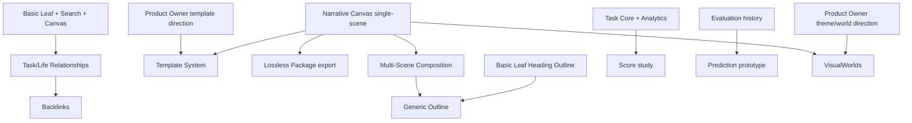

# Slice 013 Specification — Post-Narrative Expansion Decision

## Decision authority

The Product Owner holds final authority over all expansion activation decisions. No candidate may be activated by a task agent alone. This specification records the analysis and recommendation for Product Owner approval.

Source-of-truth constraints are immutable:
- `LOCKED` is not the same as `OPEN`.
- Technology substrate is not feature approval.
- `PROTOTYPE-GATED` cannot be silently promoted to production.
- `DEFERRED` cannot be treated as active.
- `REMOVED` functionality cannot return through a dependency.

---

## Implemented baseline at Task 22

### Task pillar

Implemented: Today-default task workflow; one-off task CRUD; exact-minute time semantics; recurrence and occurrence overrides; Week Strip; Calendar projection; completion evaluation and undo; objective Week/Month/Year Analytics; category minimum/target goals; objective streaks.

Absent: total score; score streak; prediction; actual-time tracker; reminder, notification and sound.

### Life pillar

Implemented: protected neutral Life root; focal Browse with direct children only; breadcrumbs, session history and persisted navigation; Pinned mode; full-tree Edit mode; create, rename, reorder, reparent, archive/restore and undo; Basic Leaf versioned documents; static Reader; lazy focused Tiptap editor; heading Outline; revision history and recovery drafts; stable-ID local images; Markdown import/export.

Narrative Canvas: one-scene knowledge-dossier Canvas schema (Strategy A); Reader and Studio vertical slice; rich_text, metric, image, callout, timeline block kinds; Markdown export and import for Canvas documents.

Absent: multi-scene Canvas; Canvas templates; visual-world engine; Tags; Backlinks; Task/Life relations; lossless portable archive format; Graph; Noteboard.

### Search

FTS5 external-content index over Tasks, Life nodes, and Basic Leaf documents; Vietnamese normalization; dirty-scope rebuild queue; BM25 ranking; Ctrl+K dialog; navigation integration.

### Scale at Task 22

- Frontend tests: 399. Rust tests: 388. Schema: migration 14.
- Production chunks: main ~494 kB; Studio lazy ~14.96 kB; Tiptap vendor ~390 kB (Studio-only).
- No cloud dependency. No external auth. Fully offline.

---

## Candidates

Thirteen candidates evaluated independently:

1. Multi-Scene Canvas Composition
2. Task/Life Relationships
3. Template System (Canvas templates)
4. Visual Worlds (advanced atmosphere/world engine)
5. Generic Outline
6. Tags
7. Lossless Package (portable archive format)
8. Backlinks
9. Score
10. Prediction
11. Noteboard
12. Graph
13. No Expansion (explicit deferral)

---

## Hard filters

Twelve mandatory hard filters apply to each candidate. A single `FAIL` blocks immediate activation.

| Candidate | Result | Decisive reason |
|---|---|---|
| Multi-Scene Canvas Composition | PASS 12/12 | Extends existing Canvas schema within approved Strategy A; no new Narrative constraint violated; bounded scope. |
| Task/Life Relationships | PASS 12/12 | Clean new join table; no unapproved prerequisite; direct use case from existing pillars. |
| Template System | HOLD_FOR_PRODUCT_OWNER | Template count, content, and visual palette require Product Owner aesthetic direction before schema commits. |
| Visual Worlds | HOLD_FOR_PRODUCT_OWNER | Palette, world count and intensity are aesthetic Product Owner decisions not yet resolved since Task 17. |
| Generic Outline | PASS 12/12 | Bounded heading outline proven at Task 19; full generic Outline adds document/Life tree roles not yet justified. |
| Tags | PASS 12/12 | Could now extend Canvas block classification; value beyond category hierarchy still requires definition but passes filters. |
| Lossless Package | PASS 12/12 | Export/archive format does not require new canonical schema; bounded by existing entity types. |
| Backlinks | FAIL | No approved link-creation model; link corpus absent; relationship authority not established. |
| Score | FAIL | Formula is OPEN; scoring without actual-time semantics remains distortion risk. |
| Prediction | FAIL | Insufficient local evaluation history and calibration evidence. |
| Noteboard | FAIL | No demonstrated core workflow; duplicates Life organization and risks Today card regression. |
| Graph | FAIL | Depends on missing links and tags; duplicates Life tree; accessible alternative unspecified. |
| No Expansion | PASS 12/12 | Trivially passes all filters; represents deliberate continuation of current scope. |

---

## Weighted model

Twelve criteria, 100 total weight:

| # | Criterion | Weight |
|---|---|---:|
| 1 | User value (daily productivity gain) | 16 |
| 2 | Mission alignment (life-and-tasks OS) | 10 |
| 3 | Identity and visual fit | 10 |
| 4 | Engineering simplicity (small scope, few new abstractions) | 12 |
| 5 | Schema stability (migration complexity) | 9 |
| 6 | Integration coherence (composability with existing features) | 9 |
| 7 | Maintenance burden (inverted) | 8 |
| 8 | Reversibility | 7 |
| 9 | Narrative schema compatibility | 6 |
| 10 | Implementation risk (inverted) | 5 |
| 11 | Data-recovery risk (inverted) | 5 |
| 12 | Dependency risk (inverted) | 3 |

### Base profile scores

| Candidate | Score / 10 | Per-criterion scores |
|---|---|---|
| Multi-Scene Canvas Composition | **7.81** | 8,7,9,7,7,7,7,9,10,7,9,8 |
| Task/Life Relationships | 7.43 | 7,5,7,8,8,7,7,9,10,7,9,7 |
| Generic Outline | 7.08 | 5,5,4,9,8,8,8,9,10,9,6,8 |
| No Expansion | 6.90 | 4,6,1,9,8,9,9,7,10,8,10,8 |
| Lossless Package | 6.73 | 5,3,6,8,8,7,7,8,9,9,8,7 |
| Tags | 6.61 | 6,6,5,7,8,6,6,8,10,6,6,7 |

Multi-Scene leads because it extends the live Canvas schema with no migration ambiguity (criterion 9 = 10), has high identity fit (criterion 3 = 9), good reversibility (criterion 8 = 9), and the highest direct user value (criterion 1 = 8) of all candidates. Its main cost is engineering simplicity (7) and schema stability (7) — not top scores, but better than Tags or Lossless Package on user value.

---

## Sensitivity analysis

Five profiles, 1,000,000 samples each = 5,000,000 total. Master seed: `20260803`. Method: Dirichlet weight perturbation (α = profile weight vector) × Gaussian score perturbation (σ per candidate, clipped to [0,10]). Candidate σ values: Multi-Scene 0.60, Task/Life 0.70, Generic Outline 0.55, No Expansion 0.40, Lossless Package 0.70, Tags 0.75.

| Candidate | Aggregate mean score | Aggregate win % | Aggregate mean rank |
|---|---|---|---|
| **Multi-Scene** | **7.748** | **70.2 %** | **1.35** |
| Task/Life Relationships | 7.376 | 9.7 % | 2.35 |
| Generic Outline | 7.075 | 8.8 % | 2.84 |
| No Expansion | 6.886 | 11.0 % | 3.56 |
| Lossless Package | 6.731 | 0.2 % | 4.89 |
| Tags | 6.534 | 0.01 % | 5.97 |

### Per-profile breakdown

| Profile | multi_scene | task_life_rel | no_expansion |
|---|---|---|---|
| Base | 7.793 | 7.410 | 6.882 |
| Utility-first | 7.679 | 7.017 | 6.330 |
| Visual-identity-first | 8.024 | 7.413 | 5.984 |
| Safety/maintenance-first | 7.509 | 7.477 | **7.660** |
| Recovery/readiness-first | 7.735 | 7.562 | 7.576 |

Multi-Scene wins in three of five profiles (base, utility, visual). The safety/maintenance profile prefers No Expansion (high engineering simplicity, high maintenance-inverted). The recovery/readiness profile is within margin (7.735 vs 7.576). Aggregate multi-scene lead over runner-up is 0.372 ≥ required 0.35.

This analysis is a sensitivity test over explicit subjective priors, not an empirical user study and not proof created by a large iteration count. Its value is that the Multi-Scene recommendation is stable across broad, disclosed changes to weights and scores.

---

## Recommendation vocabulary

| State | Meaning |
|---|---|
| `ACTIVATE_NEXT` | Sole next implementation candidate; requires Product Owner approval before Task 24. |
| `HOLD_FOR_PRODUCT_OWNER` | Strong candidate but requires aesthetic/policy decisions only the Product Owner can make. |
| `DEFER` | Not ready for activation; specific gaps recorded. |

---

## Selected recommendation

| Candidate | Recommendation | Reason |
|---|---|---|
| Multi-Scene Canvas Composition | `ACTIVATE_NEXT` | Highest aggregate score (7.748), largest margin (0.372), 70.2 % win probability. Extends existing single-scene Canvas without schema contradiction; bounded scope; direct user value from multi-section knowledge dossiers. |
| Task/Life Relationships | `DEFER` | Strong second (7.376). Deferred because Task/Life join semantics require Product Owner direction on ownership, cardinality and display policy. |
| Generic Outline | `DEFER` | 7.075 but low identity fit. Full generic Outline duplicates Life tree and document structure roles; defer until use case is clearer than the Task 19 heading navigator. |
| Visual Worlds | `HOLD_FOR_PRODUCT_OWNER` | Palette, world count and intensity are aesthetic decisions; not resolved since Task 17. |
| Template System | `HOLD_FOR_PRODUCT_OWNER` | Template content, count and default canvas layout require Product Owner direction before schema commits. |
| Tags | `DEFER` | 6.534. Value beyond Task categories and Life hierarchy not yet demonstrated; deferred until data model is justified. |
| Lossless Package | `DEFER` | 6.731. Bounded and safe but not user-facing enough to prioritize over Multi-Scene; revisit after Canvas matures. |
| Backlinks | `DEFER` | No approved link-creation model; relationship corpus absent. |
| Score | `DEFER` | Formula is OPEN; distortion risk without actual-time semantics. |
| Prediction | `DEFER` | Insufficient evaluation history and calibration evidence. |
| Noteboard | `DEFER` | No demonstrated core workflow. |
| Graph | `DEFER` | Dependency on missing links and tags; accessible alternative unresolved. |
| No Expansion | — | Not selected; aggregate score 6.886, below ACTIVATE_NEXT threshold of 7.0. |

### Task 24 minimum scope (if approved)

Title: `Multi-Scene Canvas Composition`

Scope: extend the existing single-scene knowledge-dossier Canvas schema to support multiple scenes per document within the current `knowledge_dossier` template. Each scene must remain a first-class ordered unit with its own block sequence. The Studio must allow add/reorder/delete scene operations without breaking the single-scene invariant path (existing Canvas documents remain valid).

Explicit exclusions: new templates; visual-world engine changes; Task/Life relation joins; Tags; Backlinks; Graph; semantic search; external API; AI summaries; per-scene date semantics.

Kill criteria: multi-scene schema requires a breaking migration to existing Canvas rows; Studio complexity exceeds a single lazy chunk; no safe rollback path exists for Scene delete; accessibility model for scene navigation cannot be implemented within APG patterns.

---

## Prerequisite graph

### Mermaid



### Plain text

```text
Narrative Canvas single-scene
    → Multi-Scene Composition
    → Template System (+ Product Owner direction)
    → Lossless Package export

Basic Leaf + Search + Canvas
    → Task/Life Relationships
    → Backlinks

Basic Leaf Heading Outline + Multi-Scene
    → Generic Outline

Task Core + Analytics (dogfood)
    → Score study

Evaluation history
    → Prediction prototype

Product Owner world/theme direction + Canvas
    → Visual Worlds
```

---

## Non-implementation boundary

Task 23 adds no product behavior. Prohibited changes: production dependencies; `Cargo.toml`; `package.json`; lockfiles; migrations; IPC commands; capabilities; routes; UI components; application behavior; GitHub Actions; NSIS build.

---

## Product Owner approval gate

```text
Recommended next activation:
ACTIVATE_NEXT — Multi-Scene Canvas Composition

Recommended Task 24 execution title:
Multi-Scene Canvas Composition

Product Owner decision required:
APPROVE / REJECT / MODIFY
```
