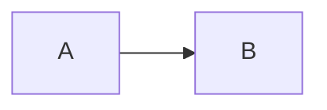

# Housing — Productive Home Infrastructure

> **Mục tiêu:** test **bold** inside quote.

## Ordered list

1. First
2. Second with **bold**, `code`, and [link](https://example.com)
3. Third

## Ordered start and nesting

4. Start four
5. Five
   1. Nested one
   2. Nested two

## Task list

- [ ] Unchecked
- [x] Checked
- [X] Checked uppercase

## Inline

Normal **bold**, *italic*, `code`, ~~strike~~, [link](https://example.com).

## Escapes

~4.284 đ
\~literal-tilde
escaped \*asterisk\* and \\ backslash
line with hard break\
next line

## Table

| Type | Value | Note |
|:---|---:|---|
| **Self use** | ~4.284 đ | escaped \| pipe |
| **Export** | ~845 đ | `code` |

## Quote inline

> **bold** *italic* `code` [link](https://example.com)

## Adjacent marks

*Label:* **value**

**Label:** **value**

***bold italic***

text **bold** text

---

## Unsupported candidate preserved as inert code

