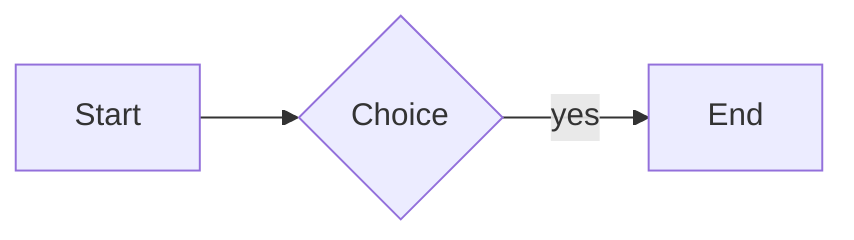

# Markdown stress corpus

This fixture exercises the declared Markdown contract from one end to the other. Every
construct here is checked by `markdown::regression`, not read by eye.

## Headings

## Level two
### Level three
#### Level four folds to three

Setext level one
================

Setext level two
----------------

## Inline runs

Plain, **strong**, *emphasis*, ***both***, ~~struck~~, `code`, and a
[safe link](https://example.com/path?query=1&other=2).

Nested marks: **bold with *italic* and `code` inside**, and ~~struck **bold** text~~.

Backticks inside code: `` a ` b ``, and a run of ```` ``` ```` inside a span.

Escapes: \* \_ \~ \` \[ \] \# \> \- \+ \. \! \\ and entities &amp; &lt; &gt; &copy;.

Currency stays text: rent is $1200, food is $300, total $1,500.00.

Underscores inside a word stay literal: snake_case_identifier, __dunder__ is strong.

A very long unbroken token: aaaaaaaaaaaaaaaaaaaaaaaaaaaaaaaaaaaaaaaaaaaaaaaaaaaaaaaaaaaaaaaaaaaaaaaaaaaaaaaaaaaaaaaaaa

A very long URL: <https://example.com/a/very/long/path/that/keeps/going/and/going/and/going/until/it/wraps>

Line one with a hard break  
line two after two spaces\
line three after a backslash
line four after a soft break.

## Unicode

Tiếng Việt có dấu, 中文字符, العربية, עברית, combining é, emoji 👨‍👩‍👧‍👦 and ✅.

## Lists

- level one
  - level two
    - level three
      - level four
        - level five
          - level six
            - level seven
              - level eight

4. starts at four
5. five with `code`
   1. nested one
   2. nested two
6. six

1) paren delimiter

- [ ] open task
- [x] done task
  - [ ] nested open task

- loose item one

- loose item two

## Quotes and callouts

> a quote
>
> > a nested quote
>
> - a list inside a quote
>
> ```
> code inside a quote
> ```

> [!NOTE]
> A note callout.

> [!WARNING]
> A warning callout.

> [!INFO] A single-line info callout.

## Code

```rust
fn main() {
    let dangerous = "<script>alert(1)</script>";
    println!("{dangerous}");
}
```

```
no language, with a tab:
	indented by a tab
```

~~~python
print("tilde fence")
~~~

````
```
a fence nested inside a wider fence
```
````



```this-language-does-not-exist
still shown verbatim
```

## Tables

| Left | Centre | Right | Plain |
|:-----|:------:|------:|-------|
| **a** | `b\|c` | [d](https://example.com) | |
| đ × 😀 | ~~e~~ | *f* | trailing |

## Math

Inline $E = mc^2$ and $\frac{a}{b}$ within a sentence.

$$
\int_0^1 x^2\,dx = \frac{1}{3}
$$

$$
\begin{matrix} a & b \\ c & d \end{matrix}
$$

## Rules

---

***

___

## Footnotes

A claim needing support[^src] and another[^second].

[^src]: The supporting note.

[^second]: A second note.

## Links that are not addressable here

A [relative link](./other.md), an [anchor](#headings), and a [protocol-relative](//example.com) target.

## Inert HTML

An <b>inline tag</b> and a line<br>break.

<!-- a comment carrying no text -->

<a id="anchor-target"></a>

## Local asset


## Malformed input

**unclosed strong

| ragged | table |
| --- | --- |
| one |
| one | two | three |

[an unresolved reference][missing]

## Heading depth

#### H4 folds to H3
##### H5 folds to H3
###### H6 folds to H3

## Duplicate headings

# Same heading

# Same heading

## Awkward inline runs

Code with a pipe: `a|b`. Code with backticks: `` a ` b ``. Code with both: `` x|`y ``.

Link with spaces: [spaced](<https://example.com/a b/c>).
Link with parens: [parens](https://example.com/a_(b)_c).
Link with escaped brackets: [\[bracketed\]](https://example.com/x).
Autolink: <https://example.com/plain>.

Unbroken token: qqqqqqqqqqqqqqqqqqqqqqqqqqqqqqqqqqqqqqqqqqqqqqqqqqqqqqqqqqqqqqqqqqqqqqqqqqqqqqqqqqqqqqqqqqqqqqqqqqqq

## Invisible and directional characters

Zero width: a​b. Non-breaking: a b. Word joiner family: 👩‍💻 and 🇻🇳.

Bidirectional: English ‏עברית‎ back to English.

## Wide table

| One | Two | Three | Four | Five | Six | Seven | Eight |
|-----|-----|------:|:----:|------|-----|-------|-------|
| a somewhat long cell value | b | 3 | 4 | e | f | g | h |
| `piped\|code` | [link](https://example.com) | ~~x~~ | **y** | *z* | 😀 | đ | |

## More math

Several in one line: $a$, $b_1$, $\gamma$, and $\frac{n}{m}$.

$$
\begin{cases} x & x > 0 \\ -x & x \le 0 \end{cases}
$$

$$
\oint_C \mathbf{F} \cdot d\mathbf{r} = \iint_S (\nabla \times \mathbf{F}) \cdot d\mathbf{S}
$$

Malformed but harmless: $\frac{1}{$ stays text-ish, and \$100 is an escaped dollar.

## Footnote shapes

Two references to one note[^shared] and again[^shared].

A reference whose note is missing[^nowhere] stays as written.

[^shared]: The shared note.

[^dup]: First definition of a duplicated label.

[^dup]: Second definition of the same label.

[^multi]: A note with two blocks.

    The second block of that note.

## Inline HTML shapes

Press <kbd>Ctrl</kbd>+<kbd>Shift</kbd>+<kbd>V</kbd> to paste as Markdown.

An <em>inline emphasis tag</em> and an <span data-x="1">inert span</span>.

<!-- a standalone comment -->

<details>
<summary>A collapsible summary</summary>

Body text inside the collapsible block.

</details>

<table><tr><td>An HTML table cell</td></tr></table>

## Dialects this product does not interpret

CriticMarkup: {++inserted++} {--deleted--} {~~old~>new~~} {==highlight==} {>>comment<<}

Pandoc fenced div:

::: warning
Pandoc puts a class on this block.
:::

Pandoc attributes: a heading with {#id .class} markers, and `code`{.language-rust}.

MkDocs admonition:

!!! note "Titled"
    Indented admonition body.

Wiki links: [[Another Note]] and [[target|label]].

Definition list: Term followed by a colon line.

Term
: The definition line.
: A second definition line.

Superscript and subscript: H~2~O, x^2^, and E=mc^2^.

Math-adjacent dollar prose: costs $5, then $10, then $1,234.56.

## Nested callouts and mixed containers

> [!WARNING]
> A warning that contains a list and a quote.
>
> - first
> - second
>
> > A quote nested inside the callout.

- A list item holding a callout:

  > [!NOTE]
  > The nested callout body.

- A list item holding a task list:

  - [x] nested done
  - [ ] nested open

## A longer code block

```python
def fibonacci(limit: int) -> list[int]:
    """Return the Fibonacci numbers below `limit`."""
    values = [0, 1]
    while values[-1] < limit:
        values.append(values[-1] + values[-2])
    return [value for value in values if value < limit]


class Example:
    def __init__(self, name: str) -> None:
        self.name = name

    def greet(self) -> str:
        return f"hello {self.name} | pipe | and $dollar and <tag>"
```

## Protocol-relative and relative targets

A [protocol-relative](//example.com/x) target, a [relative](../sibling/file.md) target, and
an [in-page](#duplicate-headings) target.
