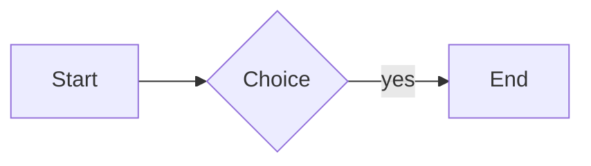

# Markdown stress corpus

This fixture exercises the declared Markdown contract from one end to the other. Every
construct here is checked by `markdown::regression`, not read by eye.

## Headings

## Level two
### Level three
#### Level four folds to three

Setext level one
================

Setext level two
----------------

## Inline runs

Plain, **strong**, *emphasis*, ***both***, ~~struck~~, `code`, and a
[safe link](https://example.com/path?query=1&other=2).

Nested marks: **bold with *italic* and `code` inside**, and ~~struck **bold** text~~.

Backticks inside code: `` a ` b ``, and a run of ```` ``` ```` inside a span.

Escapes: \* \_ \~ \` \[ \] \# \> \- \+ \. \! \\ and entities &amp; &lt; &gt; &copy;.

Currency stays text: rent is $1200, food is $300, total $1,500.00.

Underscores inside a word stay literal: snake_case_identifier, __dunder__ is strong.

A very long unbroken token: aaaaaaaaaaaaaaaaaaaaaaaaaaaaaaaaaaaaaaaaaaaaaaaaaaaaaaaaaaaaaaaaaaaaaaaaaaaaaaaaaaaaaaaaaa

A very long URL: <https://example.com/a/very/long/path/that/keeps/going/and/going/and/going/until/it/wraps>

Line one with a hard break  
line two after two spaces\
line three after a backslash
line four after a soft break.

## Unicode

Tiếng Việt có dấu, 中文字符, العربية, עברית, combining é, emoji 👨‍👩‍👧‍👦 and ✅.

## Lists

- level one
  - level two
    - level three
      - level four
        - level five
          - level six
            - level seven
              - level eight

4. starts at four
5. five with `code`
   1. nested one
   2. nested two
6. six

1) paren delimiter

- [ ] open task
- [x] done task
  - [ ] nested open task

- loose item one

- loose item two

## Quotes and callouts

> a quote
>
> > a nested quote
>
> - a list inside a quote
>
> ```
> code inside a quote
> ```

> [!NOTE]
> A note callout.

> [!WARNING]
> A warning callout.

> [!INFO] A single-line info callout.

## Code

```rust
fn main() {
    let dangerous = "<script>alert(1)</script>";
    println!("{dangerous}");
}
```

```
no language, with a tab:
	indented by a tab
```

~~~python
print("tilde fence")
~~~

````
```
a fence nested inside a wider fence
```
````



```this-language-does-not-exist
still shown verbatim
```

## Tables

| Left | Centre | Right | Plain |
|:-----|:------:|------:|-------|
| **a** | `b\|c` | [d](https://example.com) | |
| đ × 😀 | ~~e~~ | *f* | trailing |

## Math

Inline $E = mc^2$ and $\frac{a}{b}$ within a sentence.

$$
\int_0^1 x^2\,dx = \frac{1}{3}
$$

$$
\begin{matrix} a & b \\ c & d \end{matrix}
$$

## Rules

---

***

___

## Footnotes

A claim needing support[^src] and another[^second].

[^src]: The supporting note.

[^second]: A second note.

## Links that are not addressable here

A [relative link](./other.md), an [anchor](#headings), and a [protocol-relative](//example.com) target.

## Inert HTML

An <b>inline tag</b> and a line<br>break.

<!-- a comment carrying no text -->

<a id="anchor-target"></a>

## Local asset


## Malformed input

**unclosed strong

| ragged | table |
| --- | --- |
| one |
| one | two | three |

[an unresolved reference][missing]
